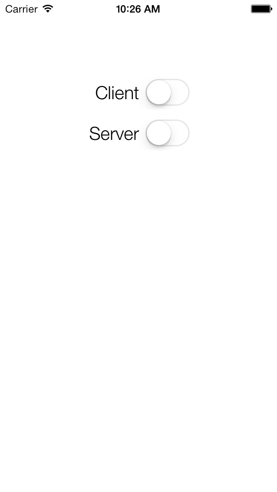
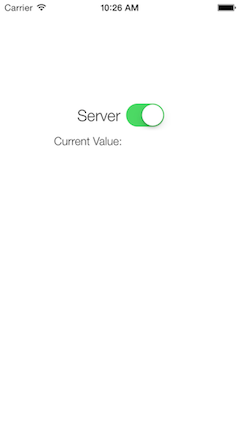

# OWUProximityManager

Detect and connect to nearby devices with iBeacons and CoreBluetooth.

## Sample Project

To simulate functionality, select Client on one device, **then** select Server on the other. As the proximity of the test devices is likely pretty close, expect delegate methods to fire quickly.

  

## Usage
Just, create a few UUIDs for `OWUProximityManagerConstants.h` and then

Setup the Sever:
``` objective-c
[[OWUProximityManager shared] startupServerWithDelegate:delegate]
```
Setup the Client:
``` objective-c
[[OWUProximityManager shared] startupClientWithDelegate:delegate]
// defaults to CLProximityNear
[OWUProximityManager shared].desiredProximity = CLProximityImmediate
```
Two things:
- `proximityClientDidEnterRegion` will not be called if the Client starts while already in range of the Server
- `proximityClientDidExitRegion` will not be called until about a minute after exiting the region ([dev forum link](https://devforums.apple.com/message/898335#898335))

## ToDo's
- More fine tuning of BeaconRegion measured power
- Handle invalidated services in `OWUProximityServer`
- Properly handle return from local notification
- And moar.
- Suggestions, issues and pull requests are more than welcome.

## Contact

David Ohayon

- [twitter.com/ohayon](http://twitter.com/ohayon)
- ohayon.1@gmail.com
- [ohwutup.com](http://ohwutup.com)

## License
OWUProximityManager is available under the MIT license. See the LICENSE file for more info.
